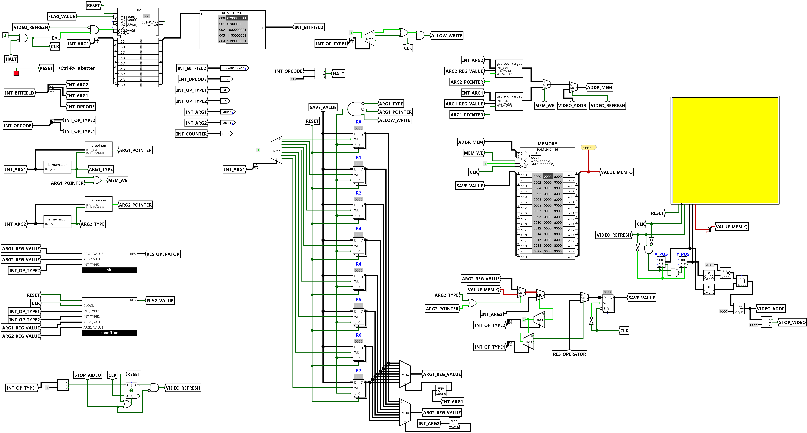
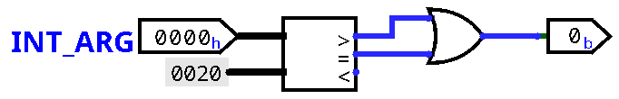
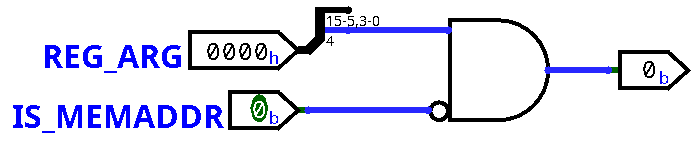
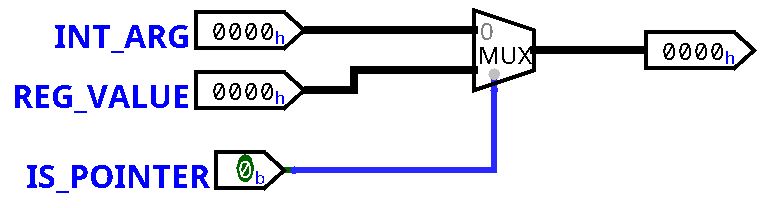
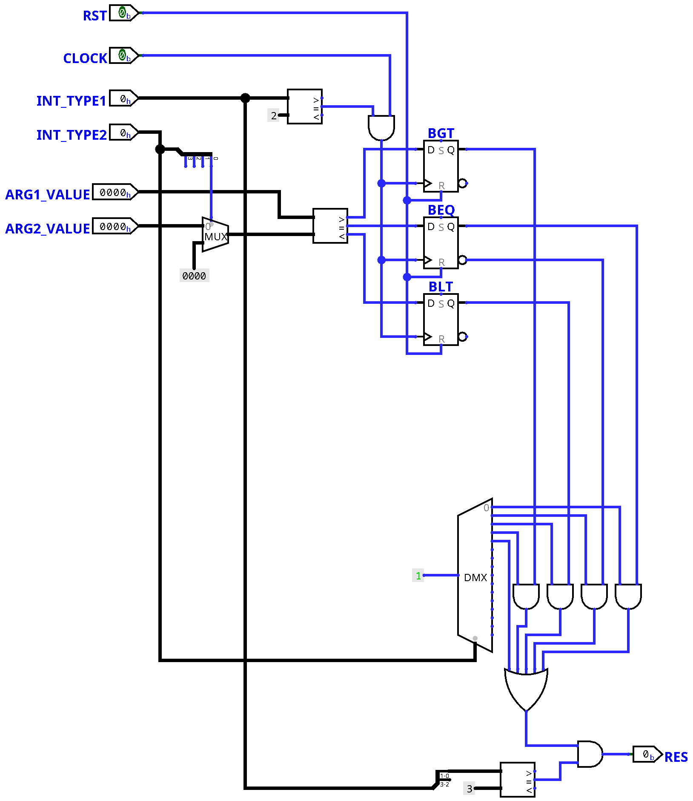

# cComputer (WIP)
cComputer stands for `Cryx's computer` 
This is an attempt to make a very basic CPU with its own assembly language and compiler without any prior important knowledge. This repository is more an experiment that anything else. Therefore it SHOULD NOT be used in any of your projects or even has a relevant example. Logisim Evolution will be used to create the different needed circuits for the CPU.

`16-bits` CPU  
`40-bits` Instructions wide

### Display
    64x64   Screen
    15-bits Colors

### Memory
    Program:            ROM 512   x 40
    General + Video:    RAM 64K   x 16 (0x0000 - 0x0020 reserved)
                                       (0xF000 - 0xFFFF video)

### Instructions

#### Syntax
    '#1234'  => decimal format
    '#$ABCD' => hexadecimal format
    '#%1011' => binary format

    'xxxx:' => Create a label named xxxx

#### Register codes
    R0: 0x0000 => General purpose
    R1: 0x0001 => General purpose
    R2: 0x0002 => General purpose
    R3: 0x0003 => General purpose
    R4: 0x0004 => General purpose
    R5: 0x0004 => General purpose
    R6: 0x0004 => General purpose
    R7: 0x0005 => General purpose

#### Instructions set
    - If a '=>' is visible, it means that the value will be stored into the
      concerned register.
    - CMP and TST will store their value (1/0) into a flag.
    - Pointers can be used for instructions with *R args, such as MOV and SET. 
      eg: MOV *R0 R1, will copy the content of the memory at address R0 into R1
      The usage of pointers will be ignored for CMP and TST

    R=Register; A=Address; V=Value; L=Label; *=Pointer

    8-bits      16-bits 16-bits
    0xAB        0xABCD  0xABCD

    0x00    NOP                     // Nothing
    0x01    MOV *RAx *RAy           // Move Y to X
    0x02    SET *RA  V              // Set value V

    0x10    ADD Rx Ry => Rx=Rx+Ry   // Add
    0x11    SUB Rx Ry => Rx=Rx-Ry   // Subtract
    0x12    MUL Rx Ry => Rx=Rx*Ry   // Multiply
    0x13    DIV Rx Ry => Rx=Rx/Ry   // Divide

    0x14    NOT Rx    => Rx=!Rx     // NOT operator
    0x15    AND Rx Ry => Rx=Rx&Ry   // AND operator
    0x16    ORR Rx Ry => Rx=Rx|Ry   // OR operator
    0x17    XOR Rx Ry => Rx=Rx^Ry   // XOR operator
    0x18    ROL Rx Ry => Rx         // Left rotation of Ry bits
    0x19    ROR Rx Ry => Rx         // Right rotation of Ry bits 

    0x20    CMP Rx Ry               // Compare Rx to Ry
    0x21    TST R                   // Test R

    0x30    BEQ L                   // Go to label L if equal
    0x31    BNE L                   // Go to label L if not equal
    0x32    BLT L                   // Go to label L if lesser than
    0x33    BGT L                   // Go to label L if bigger than
    0x34    JMP L                   // Go to label L

    0xF0    VID                     // Refresh video output

    0xFF    HLT                     // Halt, stop the program

## Usage
- Create a `.casm` file (examples are available in `./examples/`)
- In `./compiler/` run `make` to create the compiler.
- Once the compiler is ready, run `./cryxc path_to_file.casm` to compile the file, a file `out.cout` will be created.
You can also run `./cryxc file.casm output_name` to create instead the file `output_name.cout` in the desired directory.
- Run *Logisim Evolution*, load `./circuits/main.circ` and load the `.cout` file into the ROM.
- Go into the **Simulation** tab to config the simulation and to run it.
- If you want to reset the simulation, you can click on the red button or press `Ctrl-R`.

## The circuits

    
Main circuit

    

    
Subcircuit is_memaddr

    

    
Subcircuit is_pointer

    

    
Subcircuit get_addr_target

    

    
Subcircuit condition

    

    
Subcircuit ALU

    

